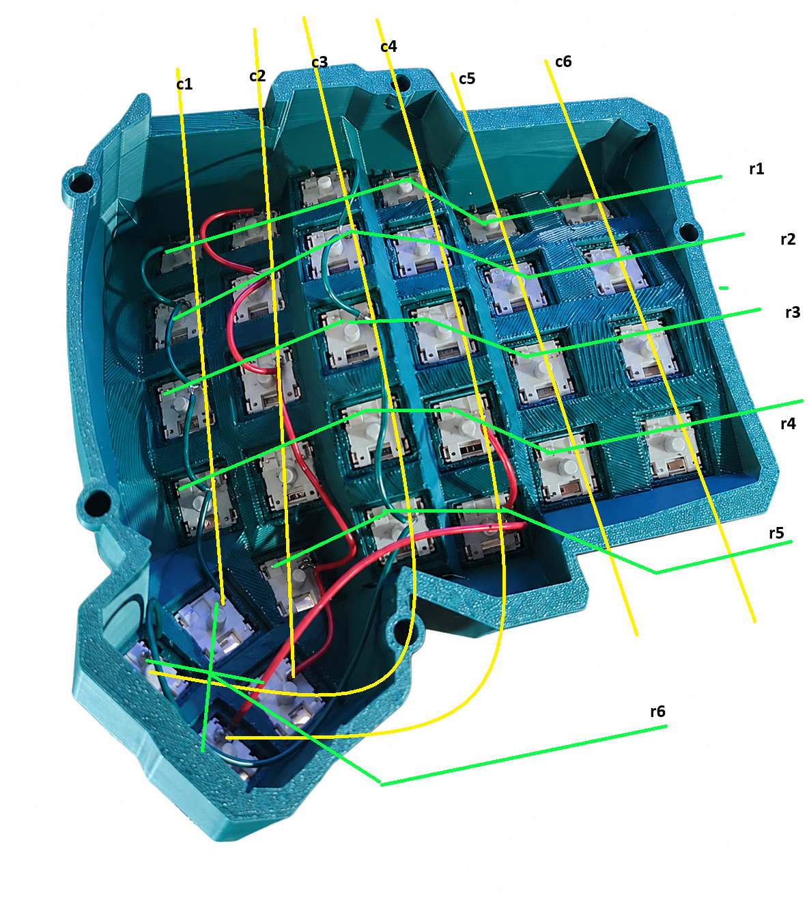

### ⚙️ &nbsp;GitHub Analytics

<p align="center">
  <a href="https://github.com/furknozg">
    
    
  </a>
</p>

---

### ✨ &nbsp;My Tech Stack

<p align="center" style="display: flex; flex-wrap: wrap; gap: 10px;">
  
  
  
  
  
  
  
  
  
  
  
  
  
</p>

---

### ⌨️ &nbsp;My Keeb

<p align="center">
  
</p>

<p align="center">
  <em>Here is my favourite keyboard that I currently use, a Dactyl Manuform. Hit me up if you need any help building one of your own from scratch.</em>
</p>

---

### 🧑‍🍳 &nbsp;Keyboard Wiring Recipe

#### 🔌 &nbsp;Matrix Wiring

<p align="center">
  
</p>

The keyboard is wired as a matrix instead of giving every switch its own pin. In the diagram above, the **yellow lines are columns** (`c1` to `c6`) and the **green lines are rows** (`r1` to `r6`). Each key sits where one row and one column meet, so the firmware scans the columns and rows to figure out which switch is being pressed.

For this layout, keep each column as one clean vertical chain and each row as one clean horizontal-ish chain. The physical wire does not have to be perfectly straight inside a Dactyl shell, but the electrical idea should stay simple: every switch joins exactly one row and exactly one column.

<p align="center">
  
</p>

The Pro Micro turns that matrix into USB keyboard input. The row wires connect to one group of controller pins, and the column wires connect to another group. In firmware, those same pins need to be listed in the same row and column order you physically wired.

For a split keyboard, the two halves talk through a **TRRS, TRS, or RJ9 cable**. One half is the main side plugged into USB, and the other half sends its key presses over the interconnect. A typical cable carries **GND**, **VCC**, and a **serial/data line**; a fourth conductor can be used for reset or another data line depending on your firmware setup. Whatever connector you choose, keep the pinout identical on both halves and avoid plugging or unplugging TRRS while the keyboard is powered, because the contacts can briefly short while sliding in.

---

#### ✅ &nbsp;Diode Row Connection

When hand-wiring a split keeb, each switch needs one diode so the matrix can tell exactly which key is pressed. Keep the diode direction consistent across the whole build before you start connecting rows.

**✅ DO:**

<p align="center">
  
</p>

- Put one diode on every switch before wiring the rows.
- Keep all diodes facing the same direction. In my builds, the **black stripe/cathode side goes toward the row wire**.
- Connect the non-striped/anode side to the switch leg, then chain the striped/cathode sides together as the row.
- Use solid core wire for row and column runs so the matrix stays tidy and easy to debug.
- Cover long exposed legs with heat shrink or electrical tape to avoid accidental shorts.
- Test continuity with a multimeter row by row before plugging the board into USB.
- Match the diode direction with your firmware setting, usually `DIODE_DIRECTION = COL2ROW` or `ROW2COL`.

**❌ DON'T:**

<p align="center">
  
</p>

- Mix diode directions within the same matrix. One flipped diode can make a key disappear.
- Let bare diode legs or row wires touch neighboring columns.
- Skip diodes; they are what prevent ghosting and weird multi-key behavior.
- Assume the row wire is correct just because it looks clean. Test it.
- Overheat diode legs while soldering; a quick, clean joint is enough.
- Wire the second half from memory if you mirrored the case. Re-check the row and column pins first.

---

#### 🧠 &nbsp;QMK Configuration

After the wiring is done, the firmware needs to describe the same matrix you built by hand. The important parts are the matrix size, the row pins, the column pins, the diode direction, and the split communication pin.

For this shape, you do not have to start from a blank keyboard every time. QMK already has a preconfigured Dactyl Manuform preset at `handwired/dactyl_manuform/5x6_5`, often referred to as `dactyl_manuform_5x6_5` in preset lists. Use it as the starting point when your layout matches a 5x6 main grid plus 5 thumb keys, then only adjust the pins, diode direction, and keymap if your wiring differs.

For a custom handwired Dactyl Manuform, the most flexible path is **QMK CLI** because it lets you define the custom wiring:

```bash
qmk setup
qmk compile -kb handwired/dactyl_manuform/5x6_5 -km default
qmk flash -kb handwired/dactyl_manuform/5x6_5 -km default
```

In your keyboard definition, mirror the physical wiring:

```c
#define MATRIX_ROWS 12
#define MATRIX_COLS 6

#define MATRIX_ROW_PINS { D0, D1, D2, D3, D4, C6 }
#define MATRIX_COL_PINS { B1, B2, B3, B4, B5, B6 }
#define DIODE_DIRECTION COL2ROW

#define SPLIT_HAND_PIN B7
#define SOFT_SERIAL_PIN D0
```

The exact pins above are examples, not a universal Pro Micro pinout. Use the pins from your own `pro micro wiring.png` plan, then keep the order consistent with your `LAYOUT` macro and keymap.

Use `ROW2COL` or `COL2ROW` based on which side of the switch your diode points toward. If your keys do not register, register backward, or whole rows act strange, diode direction and row/column pin order are the first things to check.

If you prefer the **QMK GUI** route, use **QMK Configurator** plus **QMK Toolbox**:

1. Open [QMK Configurator](https://config.qmk.fm/).
2. Pick `handwired/dactyl_manuform/5x6_5` (shown as `dactyl_manuform_5x6_5` in some preset lists).
3. Edit the keymap visually.
4. Compile and download the firmware file.
5. Open the file in [QMK Toolbox](https://qmk.fm/toolbox).
6. Put the Pro Micro into bootloader mode, then flash.

The GUI flow is great for changing keymaps and flashing firmware, but for a one-off handwired board you usually still need QMK source/CLI first because Configurator cannot guess your custom matrix pins, split wiring, or diode direction. After the keyboard definition exists, the GUI becomes much more useful.

Useful tip: add a firmware key for bootloader mode on a layer, usually with `QK_BOOT`. That can save you from needing a dedicated reset button every time you want to flash new firmware. For example, put it on a function layer key you will not hit by accident:

```c
[1] = LAYOUT(
    _______, _______, _______, _______, _______, QK_BOOT,
    _______, _______, _______, _______, _______, _______
)
```

On older QMK keymaps you may see `RESET`; `QK_BOOT` is the newer name for jumping into the bootloader.

Useful official QMK docs:
- [How a Keyboard Matrix Works](https://docs.qmk.fm/how_a_matrix_works)
- [Hand-Wiring Guide](https://docs.qmk.fm/hand_wire)
- [Split Keyboard](https://docs.qmk.fm/features/split_keyboard)
- [QMK CLI Commands](https://docs.qmk.fm/cli_commands)
- [QMK Configurator](https://docs.qmk.fm/newbs_building_firmware_configurator)
- [QMK Flashing and Toolbox](https://docs.qmk.fm/flashing)

Big shoutout to this guide for helping make Dactyl Manuform builds feel less mysterious: [Complete Idiot Guide for Building a Dactyl Manuform Keyboard](https://medium.com/swlh/complete-idiot-guide-for-building-a-dactyl-manuform-keyboard-53454845b06)

---

### 🤝🏻 &nbsp;Connect with Me

<p align="left">
  <a href="https://linkedin.com/in/furkan-özgültekin-367936199/">
    
  </a>
  &nbsp;&nbsp;
  <a href="mailto:furkanozgultekin@gmail.com">
    
  </a>
</p>
