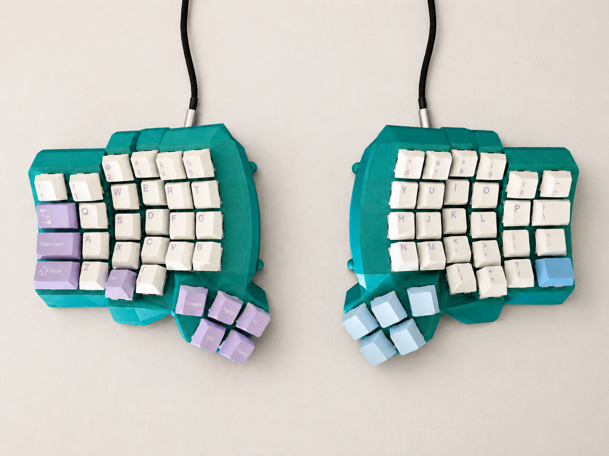

### ⚙️ &nbsp;GitHub Analytics

  

---

### ✨ &nbsp;My Tech Stack

  
  
  
  
  
  
  
  
  
  
  
  
  

---

### ⌨️ &nbsp;My Keeb

  

  <em>Here is my favourite keyboard that i currently use, a dactyl manuform. Hit me up if you need any help building one of your own from scratc</em>

---

### 🤝🏻 &nbsp;Connect with Me

  
  &nbsp;&nbsp;
  

